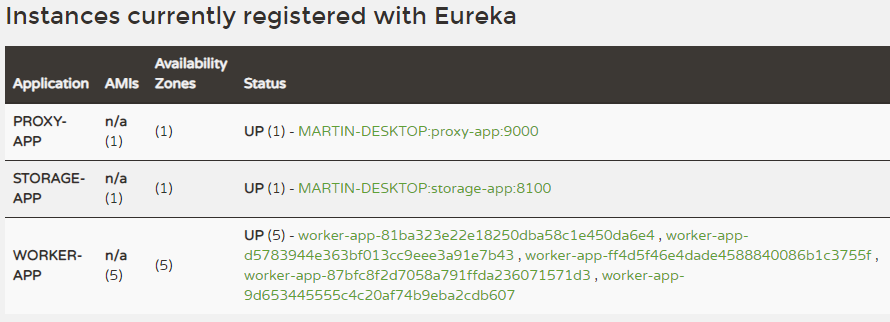

# docker-distributed-hashing
An example of how distributed work (in this case, simple hashing) could be formulated in a cloud environment.

## Goals

* Stand up and scale services using Docker Compose
* Integrate Docker image building into the build pipeline (Using Fabric8 in this case)
* Distributed system integration using service discovery (Using Netlfix Eureka, OpenFeign) (e.g. not relying on port management other than the service registry)
* Use service registry aware reverse proxying (Using Netflix Zuul)
* "Memoize" work requests (Using Redis / Spring Data Redis)
* Find some excuse to practice very simple data modeling using Apache Cassandra

### Secondary Goals / Wishlist / Future Weekend Plans

* Use Spring Data REST Repository Resource for the storage app
* Stand up a Spring Config Server

## System Overview

## Service Discovery with Spring Cloud

Integrating services using a service registry is trivial using my favorite umbrella project: Spring Cloud. It allows me to stand up any amount of worker services to scale-out the work.  

The Zuul proxy is aware of Eureka, and will consult it to understand where to reverse proxy incoming requests to. By default, load balancing is done using simple round robin.

Spring Cloud comes with support for Feign, a declarative REST client, which allows me to create registry-aware integration interfaces.

